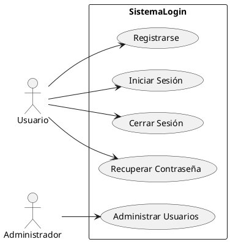
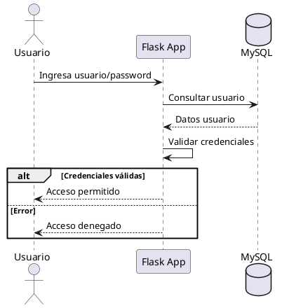
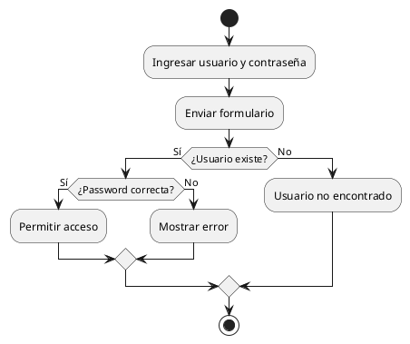
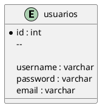
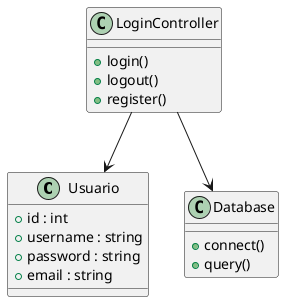

# 📘 UML — SDLC Tradicional para Login con Flask y MySQL

## 📌 Descripción

El presente documento muestra el modelado UML para un sistema de autenticación desarrollado con:

- Python
- Flask
- MySQL

Bajo un enfoque de:

- **SDLC Tradicional (Software Development Life Cycle)**

Los diagramas permiten representar:

- Funcionalidades
- Flujo del sistema
- Interacción entre componentes
- Modelo de datos
- Estructura orientada a objetos

---

# 📖 Índice

1. Diagrama de Casos de Uso  
2. Diagrama de Secuencia  
3. Diagrama de Flujo  
4. Diagrama Entidad Relación  
5. Diagrama de Clases  

---

# 1️⃣ Diagrama de Casos de Uso — SDLC Tradicional

## 📌 Descripción

Este diagrama representa las funcionalidades principales del sistema y la interacción entre los actores y el sistema de login.

## 🎯 Actores

- Usuario
- Administrador

## ⚙️ Funcionalidades

- Registro
- Inicio de sesión
- Cierre de sesión
- Recuperación de contraseña
- Administración de usuarios

---

## 🧩 Código PlantUML

---

# 2️⃣ Diagrama de Secuencia — SDLC Tradicional

## 📌 Descripción

Este diagrama representa la interacción temporal entre:

- Usuario
- Aplicación Flask
- Base de datos MySQL

Durante el proceso de autenticación.

---

## 🧩 Código PlantUML

---

# 3️⃣ Diagrama de Flujo — SDLC Tradicional

## 📌 Descripción

Este diagrama representa el flujo lógico del proceso de autenticación del usuario.

---

## 🧩 Código PlantUML

---

# 4️⃣ Diagrama Entidad Relación — SDLC Tradicional

## 📌 Descripción

Este modelo representa la estructura básica de la base de datos para el sistema de autenticación.

---

## 🧩 Entidad Principal

### `usuarios`

| Campo | Tipo |
|---|---|
| id | int |
| username | varchar |
| password | varchar |
| email | varchar |

---

## 🧩 Código PlantUML

---

# 5️⃣ Diagrama de Clases — SDLC Tradicional

## 📌 Descripción

Este diagrama representa la estructura orientada a objetos del sistema.

Incluye:

- Modelo de usuario
- Controlador de login
- Conexión a base de datos

---

## 🧩 Clases Principales

### 📦 Usuario

Representa la entidad del sistema autenticado.

### 📦 LoginController

Gestiona:

- Login
- Logout
- Registro

### 📦 Database

Administra la conexión y consultas SQL.

---

## 🧩 Código PlantUML

---

# 📚 Tecnologías Utilizadas

- Python
- Flask
- MySQL
- PlantUML
- Git
- GitHub

---

# 🚀 Objetivo del Modelado

El objetivo de estos diagramas es:

- Analizar el sistema antes de implementarlo
- Comprender la arquitectura
- Identificar componentes principales
- Documentar el flujo de autenticación
- Facilitar futuras mejoras de seguridad

---

# 🛠️ Recomendación

Para visualizar los diagramas PlantUML se recomienda utilizar:

- Extensión PlantUML en VS Code
- Servidor oficial de PlantUML
- Extensión de diagramas en GitHub Markdown
