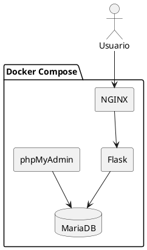
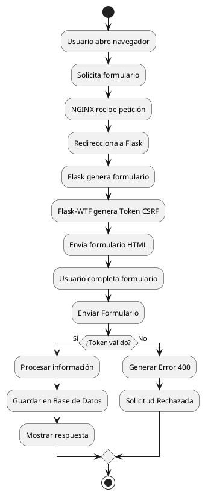
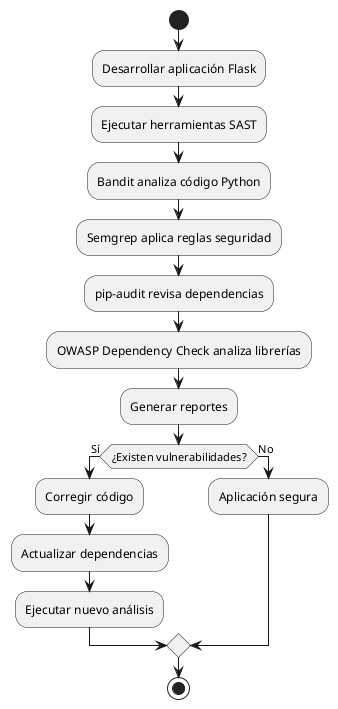

# Laboratorio: Implementación de Protección CSRF en Flask utilizando Flask-WTF
## Objetivos
### Objetivo General
Implementar mecanismos de protección contra ataques **Cross-Site Request Forgery (CSRF)** en una aplicación desarrollada con **Flask**, utilizando la librería **Flask-WTF**, desplegando la solución mediante una arquitectura contenerizada con **Docker Compose**, **NGINX**, **Flask**, **MariaDB** y **phpMyAdmin**.
---
### Objetivos Específicos
- Implementar una arquitectura multicontenedor utilizando Docker Compose.
- Configurar un servidor NGINX como Reverse Proxy para la aplicación Flask.
- Implementar formularios seguros utilizando Flask-WTF.
- Incorporar protección automática mediante Tokens CSRF.
- Utilizar variables de entorno para proteger información sensible.
- Administrar las dependencias del proyecto mediante requirements.txt.
- Preparar la aplicación para realizar análisis estático de seguridad.
---

# Arquitectura General
La arquitectura estará compuesta por cuatro contenedores:
- Cliente Web
- NGINX
- Flask
- MariaDB
- phpMyAdmin

El flujo será el siguiente:

```
Cliente
    │
    ▼
NGINX
    │
    ▼
Flask
    │
    ▼
MariaDB
```

---

# Diagrama de Bloques (PlantUML)



---

# Diagrama de Flujo (PlantUML)



---

# Explicación del Flujo

El funcionamiento general de la aplicación se describe a continuación:

1. El usuario accede desde su navegador web a la aplicación.

2. La petición HTTP llega inicialmente al servidor **NGINX**, el cual funciona como **Reverse Proxy**.

3. NGINX reenvía la solicitud hacia el contenedor Flask.

4. Flask procesa la petición y genera dinámicamente el formulario utilizando la librería **Flask-WTF**.

5. Flask-WTF crea automáticamente un **Token CSRF** único para la sesión del usuario.

6. El formulario HTML es enviado al navegador incluyendo el Token CSRF oculto mediante:

```html
{{ form.hidden_tag() }}
```

7. El usuario completa el formulario y envía la información.

8. Flask verifica automáticamente el Token recibido.

9. Si el Token es válido:

- Se procesa la información.
- Se ejecutan las validaciones.
- Se almacena la información en MariaDB.
- Se responde correctamente al usuario.

10. Si el Token fue eliminado, modificado o no existe:

- Flask-WTF bloquea inmediatamente la solicitud.
- Se devuelve un error HTTP 400 (Bad Request).
- Se evita el ataque CSRF.

---

# Estructura de Carpetas

```
proyecto-csrf/
│
├── app/
│   │
│   ├── static/
│   │   ├── css/
│   │   ├── js/
│   │   └── img/
│   │
│   ├── templates/
│   │   ├── base.html
│   │   ├── index.html
│   │   └── quejas.html
│   │
│   ├── forms.py
│   ├── routes.py
│   ├── models.py
│   ├── config.py
│   ├── __init__.py
│   └── app.py
│
├── docker/
│   └── Dockerfile
│
├── nginx/
│   └── nginx.conf
│
├── database/
│
├── .env
├── docker-compose.yml
├── requirements.txt
├── README.md
└── .gitignore
```

---

# docker-compose.yml

```yaml
version: "3.9"

services:

  nginx:
    image: nginx:latest
    container_name: nginx

    ports:
      - "80:80"

    volumes:
      - ./nginx/nginx.conf:/etc/nginx/nginx.conf

    depends_on:
      - flask

    restart: always

  flask:

    build:
      context: .
      dockerfile: docker/Dockerfile

    container_name: flask

    env_file:
      - .env

    volumes:
      - ./app:/app

    depends_on:
      - mariadb

    restart: always

  mariadb:

    image: mariadb:11

    container_name: mariadb

    restart: always

    env_file:
      - .env

    volumes:
      - mariadb_data:/var/lib/mysql

  phpmyadmin:

    image: phpmyadmin/phpmyadmin

    container_name: phpmyadmin

    restart: always

    ports:
      - "8080:80"

    environment:

      PMA_HOST: mariadb

      PMA_PORT: 3306

    depends_on:
      - mariadb

volumes:

  mariadb_data:
```

---

# Dockerfile

Ubicación:

```
docker/Dockerfile
```

```dockerfile
FROM python:3.12-slim

WORKDIR /app

COPY requirements.txt .

RUN pip install --no-cache-dir -r requirements.txt

COPY ./app .

EXPOSE 5000

CMD ["python","app.py"]
```

---

# Configuración de NGINX

Ubicación:

```
nginx/nginx.conf
```

```nginx
events {}

http {

    upstream flask_app {

        server flask:5000;

    }

    server {

        listen 80;

        server_name localhost;

        location / {

            proxy_pass http://flask_app;

            proxy_set_header Host $host;

            proxy_set_header X-Forwarded-For $proxy_add_x_forwarded_for;

            proxy_set_header X-Forwarded-Proto $scheme;

        }

    }

}
```

---

# Archivo .env

```env
####################################
# Flask
####################################

FLASK_APP=app.py

FLASK_ENV=development

SECRET_KEY=SuperPasswordSegura2026

####################################
# Base de Datos
####################################

DB_HOST=mariadb

DB_PORT=3306

DB_NAME=laboratorio_csrf

DB_USER=admin

DB_PASSWORD=Admin123456

####################################
# MariaDB
####################################

MARIADB_ROOT_PASSWORD=root123

MARIADB_DATABASE=laboratorio_csrf

MARIADB_USER=admin

MARIADB_PASSWORD=Admin123456
```

---

# Archivo requirements.txt

```text
Flask==3.1.1

Flask-WTF==1.2.2

Flask-SQLAlchemy==3.1.1

Flask-Migrate==4.1.0

Flask-Login==0.6.3

Flask-MySQLdb==2.0.0

mysqlclient==2.2.7

WTForms==3.2.1

python-dotenv==1.1.1

gunicorn==23.0.0
```

---

# Resultado Esperado

Al finalizar esta primera parte del laboratorio se contará con:

- Una arquitectura contenerizada basada en Docker Compose.
- Un servidor NGINX funcionando como Reverse Proxy.
- Un contenedor Flask listo para ejecutar la aplicación.
- Una base de datos MariaDB para el almacenamiento de información.
- phpMyAdmin para la administración de la base de datos.
- Variables de entorno centralizadas mediante el archivo `.env`.
- Gestión de dependencias mediante `requirements.txt`.
- Una estructura organizada del proyecto preparada para implementar protección contra ataques CSRF utilizando Flask-WTF.

````markdown
# PARTE 2 - ACTIVIDAD 1
# Revisión de Hallazgos sobre Dependencias de Seguridad

## Objetivo de la Actividad

En esta actividad se incorporará la librería **Flask-WTF** al proyecto Flask con el objetivo de implementar mecanismos de protección contra ataques **Cross-Site Request Forgery (CSRF)**. Asimismo, se actualizará el archivo `requirements.txt` para mantener un control adecuado de las dependencias del proyecto.

---

# ¿Qué es Flask-WTF?

Flask-WTF es una extensión de Flask que facilita la creación y validación de formularios web utilizando WTForms. Además, incorpora de manera automática un mecanismo de protección contra ataques CSRF mediante la generación y validación de **tokens de seguridad**.

Entre sus principales ventajas se encuentran:

- Creación de formularios orientados a objetos.
- Validación automática de datos.
- Protección contra ataques CSRF.
- Integración sencilla con plantillas Jinja2.
- Mayor organización y reutilización del código.

---

# ¿Qué es un Hallazgo de Seguridad?

Durante un análisis estático o una auditoría de código fuente, las herramientas de seguridad pueden detectar vulnerabilidades relacionadas con formularios inseguros.

Uno de los hallazgos más frecuentes es:

> **Formulario HTML sin protección CSRF**

Cuando un formulario no implementa un mecanismo de validación mediante tokens, un atacante puede enviar solicitudes maliciosas en nombre de un usuario autenticado.

---

# ACTIVIDAD 1
## Revisión de Hallazgos sobre Dependencias de Seguridad

---

## PASO N° 1
### Activar el entorno virtual

Antes de instalar nuevas dependencias, es recomendable activar el entorno virtual del proyecto.

### Windows

```bash
venv\Scripts\activate
```

### Linux / Ubuntu / Debian

```bash
source venv/bin/activate
```

### Resultado esperado

La consola mostrará algo similar a:

```bash
(venv) usuario@equipo:~/proyecto-csrf$
```

---

## PASO N° 2
### Verificar la versión de Python

Antes de instalar cualquier dependencia, verificar que Python esté funcionando correctamente.

```bash
python --version
```

Resultado esperado:

```text
Python 3.12.x
```

---

## PASO N° 3
### Verificar la versión de pip

```bash
pip --version
```

Resultado esperado:

```text
pip 25.x
```

---

## PASO N° 4
### Instalar Flask-WTF

Ejecutar el siguiente comando:

```bash
pip install flask-wtf
```

Salida esperada:

```text
Collecting flask-wtf
Collecting wtforms
Installing collected packages:

WTForms

Flask-WTF

Successfully installed
```

---

## ¿Qué ocurrió durante la instalación?

Durante este proceso, **pip** descargó automáticamente:

- Flask-WTF
- WTForms

Estas bibliotecas serán utilizadas posteriormente para crear formularios seguros y habilitar la protección contra ataques CSRF.

---

## PASO N° 5
### Verificar que Flask-WTF fue instalado

Ejecutar:

```bash
pip show flask-wtf
```

Resultado esperado:

```text
Name: Flask-WTF

Version: 1.2.2

Summary: Simple integration of Flask and WTForms

Location:

/venv/lib/python3.12/site-packages
```

---

## PASO N° 6
### Mostrar todas las dependencias instaladas

Ejecutar:

```bash
pip freeze
```

Resultado esperado (ejemplo):

```text
click==8.2.1
Flask==3.1.1
Flask-Login==0.6.3
Flask-Migrate==4.1.0
Flask-MySQLdb==2.0.0
Flask-SQLAlchemy==3.1.1
Flask-WTF==1.2.2
gunicorn==23.0.0
itsdangerous==2.2.0
Jinja2==3.1.6
MarkupSafe==3.0.2
mysqlclient==2.2.7
python-dotenv==1.1.1
SQLAlchemy==2.0.x
Werkzeug==3.1.x
WTForms==3.2.1
```

---

## PASO N° 7
### Actualizar el archivo requirements.txt

Una vez instaladas las nuevas dependencias, actualizar el archivo `requirements.txt`.

Ejecutar:

```bash
pip freeze > requirements.txt
```

Este comando sobrescribe el archivo con todas las librerías instaladas en el entorno virtual.

---

## Contenido esperado del archivo requirements.txt

```text
Flask==3.1.1
Flask-WTF==1.2.2
Flask-SQLAlchemy==3.1.1
Flask-Migrate==4.1.0
Flask-Login==0.6.3
Flask-MySQLdb==2.0.0
mysqlclient==2.2.7
WTForms==3.2.1
python-dotenv==1.1.1
gunicorn==23.0.0
```

---

# Explicación Técnica

El archivo `requirements.txt` es utilizado para registrar todas las dependencias necesarias para ejecutar correctamente el proyecto.

Esto permite que cualquier desarrollador pueda reconstruir el mismo entorno ejecutando:

```bash
pip install -r requirements.txt
```

De esta manera se garantiza que todas las versiones de las bibliotecas utilizadas sean las mismas, evitando problemas de compatibilidad entre distintos equipos de trabajo.

---

# Evidencias Solicitadas

Al finalizar esta actividad se deben capturar las siguientes evidencias:

## Evidencia N.° 1

**Instalación de Flask-WTF**

Capturar la consola mostrando:

```bash
pip install flask-wtf
```

Debe observarse el mensaje:

```text
Successfully installed Flask-WTF
```

---

## Evidencia N.° 2

**Verificación de la librería instalada**

Capturar el resultado del comando:

```bash
pip show flask-wtf
```

---

## Evidencia N.° 3

**Listado de dependencias**

Capturar el resultado de:

```bash
pip freeze
```

---

## Evidencia N.° 4

**Archivo requirements.txt**

Abrir el archivo en Visual Studio Code y capturar el contenido donde se observe la inclusión de:

```text
Flask-WTF==1.2.2
WTForms==3.2.1
```

---

# Resultado Esperado

Al finalizar la Actividad 1 se habrá logrado:

- Crear un entorno preparado para implementar formularios seguros.
- Instalar la librería Flask-WTF.
- Incorporar WTForms al proyecto.
- Actualizar el archivo `requirements.txt`.
- Mantener un control de versiones de las dependencias utilizadas.
- Preparar la aplicación para implementar protección contra ataques CSRF en las siguientes actividades.
````


````markdown
# PARTE 3 - ACTIVIDAD 2
# Interpretación de Alertas CSRF en la Configuración

## Objetivo de la Actividad

En esta actividad se implementará la protección contra ataques **Cross-Site Request Forgery (CSRF)** utilizando la librería **Flask-WTF**. Se habilitará la protección CSRF a nivel global para toda la aplicación Flask mediante el módulo `CSRFProtect`.

Al finalizar esta actividad, todas las solicitudes **POST**, **PUT**, **PATCH** y **DELETE** serán validadas automáticamente mediante un **Token CSRF**, reduciendo significativamente el riesgo de ataques de falsificación de solicitudes.

---

# ¿Qué es un ataque CSRF?

**Cross-Site Request Forgery (CSRF)** es una vulnerabilidad que permite a un atacante ejecutar acciones no autorizadas en nombre de un usuario autenticado.

Cuando un usuario inicia sesión en una aplicación web, el navegador almacena automáticamente la cookie de autenticación. Si el usuario visita posteriormente un sitio malicioso, este podría enviar solicitudes al servidor aprovechando esa sesión activa.

Por ejemplo:

- Cambiar una contraseña.
- Registrar información falsa.
- Eliminar registros.
- Realizar compras.
- Transferir dinero.

Todo esto puede ocurrir sin que el usuario sea consciente de ello.

---

# ¿Cómo funciona la protección CSRF?

Flask-WTF utiliza un **Token CSRF** generado de forma aleatoria para cada sesión.

El flujo de funcionamiento es el siguiente:

1. El usuario solicita un formulario.
2. Flask genera un Token CSRF único.
3. El Token se inserta automáticamente en el formulario HTML.
4. El usuario envía el formulario.
5. Flask compara el Token recibido con el almacenado en la sesión.
6. Si ambos coinciden, la solicitud es aceptada.
7. Si el Token fue eliminado, modificado o no existe, la solicitud es rechazada con un error HTTP 400.

---

# Implementación de la Protección CSRF

La implementación consta de tres pasos principales:

- Configurar la clave secreta (`SECRET_KEY`).
- Importar el módulo `CSRFProtect`.
- Inicializar la protección en la aplicación Flask.

---

# PASO N.º 1: Configurar la SECRET_KEY

La protección CSRF requiere una clave secreta para firmar digitalmente los tokens.

La clave será almacenada en el archivo `.env`.

## Archivo `.env`

```env
SECRET_KEY=SuperPasswordSegura2026
```

> **Importante:** En un entorno de producción, esta clave debe ser larga, aleatoria y mantenerse confidencial.

---

# PASO N.º 2: Crear el archivo de configuración

## Ubicación

```
app/config.py
```

## Código

```python
import os
from dotenv import load_dotenv

load_dotenv()

class Config:

    SECRET_KEY = os.getenv("SECRET_KEY")
```

### Explicación

- `load_dotenv()` carga automáticamente las variables definidas en el archivo `.env`.
- `SECRET_KEY` será utilizada por Flask para firmar las sesiones y generar los Tokens CSRF.

---

# PASO N.º 3: Modificar el archivo principal de Flask

## Ubicación

```
app/app.py
```

## Código

```python
from flask import Flask
from flask_wtf.csrf import CSRFProtect

from config import Config

app = Flask(__name__)

app.config.from_object(Config)

csrf = CSRFProtect(app)

from routes import *

if __name__ == "__main__":
    app.run(host="0.0.0.0", port=5000)
```

---

# Explicación del Código

### Importación de Flask

```python
from flask import Flask
```

Importa el framework principal para desarrollar la aplicación web.

---

### Importación de CSRFProtect

```python
from flask_wtf.csrf import CSRFProtect
```

Este módulo activa la protección contra ataques CSRF en toda la aplicación.

---

### Crear la aplicación Flask

```python
app = Flask(__name__)
```

Inicializa la aplicación.

---

### Cargar configuración

```python
app.config.from_object(Config)
```

Carga todas las variables definidas en `config.py`.

---

### Activar la protección CSRF

```python
csrf = CSRFProtect(app)
```

Esta línea es la más importante.

A partir de este momento:

- Todos los formularios protegidos por Flask-WTF deberán enviar un Token CSRF válido.
- Flask validará automáticamente dicho Token.
- Si el Token no es válido, la solicitud será rechazada.

---

# ¿Qué protege CSRFProtect?

Una vez activado:

- Formularios HTML.
- Solicitudes POST.
- Solicitudes PUT.
- Solicitudes PATCH.
- Solicitudes DELETE.

No afecta a las solicitudes GET, ya que estas son utilizadas únicamente para consultar información.

---

# ¿Qué ocurre internamente?

Cuando un usuario solicita un formulario:

```
Cliente
    │
    ▼
Flask
    │
    ▼
Genera Token Aleatorio
    │
    ▼
Guarda Token en la Sesión
    │
    ▼
Inserta Token Oculto en el Formulario
```

Cuando el formulario es enviado:

```
Formulario
      │
      ▼
Flask recibe Token
      │
      ▼
Compara Token recibido
con el Token almacenado
      │
      ▼
¿Coinciden?
```

Si ambos Tokens coinciden:

```
Solicitud Aceptada
```

En caso contrario:

```
HTTP 400
Bad Request
CSRF Token Missing
```

---

# Ejemplo de Error CSRF

Si un atacante intenta enviar un formulario desde otro sitio web, Flask responderá con un mensaje similar a:

```text
400 Bad Request

The CSRF token is missing.
```

O bien:

```text
The CSRF session token is missing.
```

Este comportamiento evita que terceros puedan realizar solicitudes en nombre del usuario autenticado.

---

# Beneficios de utilizar Flask-WTF

- Protección automática contra ataques CSRF.
- No requiere validar manualmente los Tokens.
- Integración sencilla con formularios WTForms.
- Compatible con Jinja2.
- Implementación recomendada por OWASP.

---

# Buenas Prácticas

Durante la implementación se recomienda:

- Mantener la `SECRET_KEY` fuera del código fuente.
- Utilizar variables de entorno (`.env`).
- No compartir la `SECRET_KEY`.
- Cambiar la clave antes de pasar a producción.
- Utilizar HTTPS para proteger la transmisión del Token.

---

# Evidencias Solicitadas

## Evidencia N.º 1

Capturar el archivo:

```
app.py
```

Mostrando la línea:

```python
csrf = CSRFProtect(app)
```

---

## Evidencia N.º 2

Capturar el archivo:

```
config.py
```

Mostrando la carga de la variable:

```python
SECRET_KEY
```

---

## Evidencia N.º 3

Capturar el archivo:

```
.env
```

Mostrando la variable:

```env
SECRET_KEY=*************
```

> **Recomendación:** Para evitar exponer información sensible, se sugiere ocultar parcialmente el valor de la clave en la captura de pantalla.

---

# Resultado Esperado

Al finalizar esta actividad se habrá conseguido:

- Configurar correctamente la variable `SECRET_KEY`.
- Integrar el módulo `CSRFProtect` en la aplicación Flask.
- Habilitar la protección automática contra ataques CSRF.
- Preparar la aplicación para implementar formularios seguros utilizando Flask-WTF en la siguiente actividad.
- Reducir el riesgo de que un atacante envíe solicitudes maliciosas utilizando la sesión de un usuario autenticado.
````


````markdown id="7n5x0p"
# PARTE 4 - ACTIVIDAD 3
# Análisis Estático de Formularios Web Seguros

## Objetivo de la Actividad

En esta actividad se desarrollará un formulario web seguro utilizando **Flask-WTF** y **WTForms**, aplicando buenas prácticas de desarrollo seguro.

Se implementará un formulario de **registro de quejas** que permitirá a los usuarios ingresar información, validando los datos antes de enviarlos al servidor.

Además, el formulario incorporará automáticamente un **Token CSRF**, el cual permitirá verificar que la solicitud proviene de una fuente legítima.

---

# ¿Por qué utilizar Flask-WTF?

Los formularios tradicionales en HTML presentan riesgos cuando no cuentan con mecanismos de validación adecuados.

Ejemplo de formulario vulnerable:

```html
<form method="POST">

<input type="text" name="nombre">

<input type="submit">

</form>
```

Este formulario presenta los siguientes problemas:

- No valida la información ingresada.
- No protege contra ataques CSRF.
- Permite enviar solicitudes externas.
- No controla tipos de datos.

---

# Formulario Seguro con Flask-WTF

Flask-WTF permite:

- Crear formularios mediante clases Python.
- Validar campos automáticamente.
- Integrar Tokens CSRF.
- Reutilizar formularios.
- Mantener separación entre lógica y presentación.

---

# Estructura del Formulario

El formulario de quejas tendrá los siguientes campos:

| Campo | Tipo | Validación |
|-|-|-|
| Nombre completo | Texto | Obligatorio |
| Correo electrónico | Email | Formato válido |
| Categoría | Select | Obligatorio |
| Descripción | TextArea | Mínimo 10 caracteres |
| Botón enviar | Submit | Acción formulario |

---

# PASO N.º 1
# Crear archivo forms.py

Ubicación:

```
app/forms.py
```

---

## Código completo

```python
from flask_wtf import FlaskForm

from wtforms import (
    StringField,
    TextAreaField,
    SelectField,
    SubmitField
)

from wtforms.validators import (
    DataRequired,
    Email,
    Length
)


class QuejaForm(FlaskForm):

    nombre = StringField(
        "Nombre Completo",
        validators=[
            DataRequired(
                message="Debe ingresar su nombre"
            ),
            Length(
                min=3,
                max=100
            )
        ]
    )


    correo = StringField(
        "Correo Electrónico",
        validators=[
            DataRequired(
                message="Debe ingresar un correo"
            ),
            Email(
                message="Correo no válido"
            )
        ]
    )


    categoria = SelectField(

        "Categoría",

        choices=[

            ("", "Seleccione"),

            ("servicio",
             "Servicio"),

            ("producto",
             "Producto"),

            ("seguridad",
             "Seguridad"),

            ("otro",
             "Otro")

        ],

        validators=[

            DataRequired(
                message="Seleccione una categoría"
            )

        ]
    )


    descripcion = TextAreaField(

        "Descripción de la queja",

        validators=[

            DataRequired(
                message="Ingrese una descripción"
            ),

            Length(

                min=10,

                max=500

            )

        ]

    )


    enviar = SubmitField(

        "Enviar Queja"

    )
```

---

# Explicación del Código

## Importación FlaskForm

```python
from flask_wtf import FlaskForm
```

Permite crear formularios compatibles con Flask-WTF.

Esta clase incluye:

- Validaciones.
- Manejo de errores.
- Protección CSRF.

---

## Campo Nombre

```python
nombre = StringField()
```

Representa un campo de texto.

Validaciones:

```python
DataRequired()
```

Obliga al usuario a ingresar información.

```python
Length()
```

Controla la cantidad mínima y máxima de caracteres.

---

## Campo Correo

```python
correo = StringField()
```

Utiliza:

```python
Email()
```

para verificar que tenga un formato válido:

Ejemplo correcto:

```
usuario@gmail.com
```

Ejemplo incorrecto:

```
usuario123
```

---

## Campo Categoría

```python
SelectField()
```

Genera una lista desplegable.

Opciones:

- Servicio.
- Producto.
- Seguridad.
- Otro.

---

## Campo Descripción

```python
TextAreaField()
```

Permite ingresar una descripción extensa.

La validación:

```python
Length(min=10,max=500)
```

evita mensajes demasiado cortos o demasiado extensos.

---

# PASO N.º 2
# Crear la Ruta para mostrar el formulario

Ubicación:

```
app/routes.py
```

---

## Código

```python
from flask import render_template, redirect, url_for, flash

from app import app

from forms import QuejaForm


@app.route("/quejas", methods=["GET","POST"])

def quejas():


    form = QuejaForm()


    if form.validate_on_submit():


        nombre = form.nombre.data

        correo = form.correo.data

        categoria = form.categoria.data

        descripcion = form.descripcion.data


        flash(
            "Queja registrada correctamente",
            "success"
        )


        return redirect(
            url_for("quejas")
        )


    return render_template(

        "quejas.html",

        form=form

    )
```

---

# Explicación del Flujo

Cuando el usuario ingresa a:

```
http://localhost/quejas
```

ocurre lo siguiente:

```
Usuario
   |
   |
   v

Ruta Flask /quejas

   |
   |
   v

Crear objeto QuejaForm

   |
   |
   v

Mostrar formulario HTML

   |
   |
   v

Usuario envía información

   |
   |
   v

validate_on_submit()

   |
   |
   +----------------+
   |                |
 Token válido    Token inválido
   |                |
   v                v

Procesar        Error CSRF

Datos           HTTP 400

```

---

# PASO N.º 3
# Integración con Bootstrap

El formulario utilizará Bootstrap 5 para mejorar la interfaz gráfica.

Características:

- Diseño responsive.
- Componentes visuales.
- Validaciones visibles.
- Mejor experiencia de usuario.

---

# Evidencias Solicitadas

## Evidencia N.º 1

Capturar el archivo:

```
forms.py
```

Debe visualizarse:

```python
class QuejaForm(FlaskForm):
```

---

## Evidencia N.º 2

Capturar las validaciones:

```python
DataRequired()

Email()

Length()
```

---

## Evidencia N.º 3

Capturar la ruta:

```
/quejas
```

Mostrando:

```python
form.validate_on_submit()
```

---

# Resultado Esperado

Al finalizar esta actividad:

- Se creó un formulario utilizando Flask-WTF.
- Se implementaron validaciones del lado servidor.
- Se preparó la estructura para incluir el Token CSRF.
- Se separó la lógica del formulario mediante `forms.py`.
- Se estableció una base segura para el desarrollo del formulario HTML.
- La aplicación queda preparada para integrar Bootstrap y el Token CSRF en la siguiente actividad.
````


````markdown
# PARTE 5 - ACTIVIDAD 5
# Interpretación del Uso de Tokens CSRF en el Código

## Objetivo de la Actividad

En esta actividad se realizará la integración del formulario creado con **Flask-WTF** dentro de una plantilla HTML utilizando **Bootstrap 5**.

El objetivo principal será incorporar el **Token CSRF** dentro del formulario web mediante la función:

```html
{{ form.hidden_tag() }}
```

Esta función agregará automáticamente un campo oculto dentro del formulario HTML, permitiendo que Flask valide que la solicitud enviada proviene de un usuario legítimo.

---

# ¿Qué es un Token CSRF?

Un **Token CSRF (Cross-Site Request Forgery Token)** es un valor único generado por el servidor que permite validar que una solicitud HTTP fue creada desde la propia aplicación.

Características principales:

- Es único por sesión de usuario.
- Es generado automáticamente por Flask-WTF.
- Se almacena en la sesión del usuario.
- Se envía junto con el formulario.
- Es validado antes de procesar una petición POST.

---

# Funcionamiento del Token CSRF

El flujo de validación es:

```
Usuario solicita formulario

        |
        v

Flask genera Token CSRF

        |
        v

Token almacenado en sesión

        |
        v

Token insertado en HTML

        |
        v

Usuario envía formulario

        |
        v

Flask compara Tokens

        |
        +----------------+
        |                |
      Igual           Diferente
        |                |
        v                v

 Procesa          Rechaza solicitud

 información      Error 400
```

---

# PASO N.º 1
# Crear plantilla HTML del formulario

Ubicación:

```
app/templates/quejas.html
```

---

# Código completo del formulario seguro

```html






<div class="container mt-5">


    <div class="card shadow">


        <div class="card-header bg-primary text-white">

            <h3 class="text-center">

                Registro de Quejas

            </h3>

        </div>


        <div class="card-body">


            <form method="POST">


                {{ form.hidden_tag() }}


                <div class="mb-3">


                    {{ form.nombre.label(
                        class="form-label"
                    ) }}


                    {{ form.nombre(
                        class="form-control",
                        placeholder="Ingrese nombre completo"
                    ) }}


                    

                        <div class="text-danger">

                            {{ error }}

                        </div>

                    


                </div>


                <div class="mb-3">


                    {{ form.correo.label(
                        class="form-label"
                    ) }}


                    {{ form.correo(
                        class="form-control",
                        placeholder="correo@ejemplo.com"
                    ) }}


                    

                        <div class="text-danger">

                            {{ error }}

                        </div>


                    


                </div>


                <div class="mb-3">


                    {{ form.categoria.label(
                        class="form-label"
                    ) }}


                    {{ form.categoria(
                        class="form-select"
                    ) }}


                    


                        <div class="text-danger">

                            {{ error }}

                        </div>


                    


                </div>


                <div class="mb-3">


                    {{ form.descripcion.label(
                        class="form-label"
                    ) }}


                    {{ form.descripcion(
                        class="form-control",
                        rows="5",
                        placeholder="Ingrese detalle de la queja"
                    ) }}


                    


                        <div class="text-danger">

                            {{ error }}

                        </div>


                    


                </div>


                <div class="text-center">


                    {{ form.enviar(
                        class="btn btn-success"
                    ) }}


                </div>


            </form>


        </div>


    </div>


</div>



```

---

# Explicación del Código

## Herencia de plantilla

```html

```

Permite reutilizar una plantilla base que contiene:

- Menú.
- Bootstrap.
- Estructura HTML.
- Scripts.

---

# Integración del Token CSRF

La línea más importante es:

```html
{{ form.hidden_tag() }}
```

---

Esta función genera automáticamente:

```html
<input 
type="hidden"
name="csrf_token"
value="TOKEN_GENERADO"
/>
```

Ejemplo:

```html
<input 
type="hidden"
name="csrf_token"
value="ImY2NzE5..."
>
```

Este valor será enviado junto con todos los datos del formulario.

---

# ¿Qué ocurre cuando se envía el formulario?

El navegador envía:

```
POST /quejas

nombre=Ricardo

correo=test@gmail.com

categoria=seguridad

descripcion=Problema encontrado

csrf_token=abc123456
```

Flask recibe la solicitud:

```
Solicitud HTTP

       |

       v

Flask-WTF

       |

       v

Validación Token CSRF

       |

       v

¿Token correcto?

```

---

# Caso 1: Token Correcto

Resultado:

```
HTTP 200 OK
```

La información puede procesarse.

---

# Caso 2: Token Incorrecto

Ejemplo:

```
csrf_token=xxxxx
```

Resultado:

```
HTTP 400 Bad Request
```

Mensaje:

```
The CSRF token is invalid.
```

---

# Caso 3: Token Eliminado

Si se elimina:

```html
{{ form.hidden_tag() }}
```

El formulario enviará:

```
nombre=Ricardo

correo=test@gmail.com
```

Pero no enviará:

```
csrf_token
```

Resultado:

```
HTTP 400

The CSRF token is missing.
```

---

# PASO N.º 2
# Crear plantilla base

Ubicación:

```
app/templates/base.html
```

---

## Código

```html
<!DOCTYPE html>

<html lang="es">


<head>

<meta charset="UTF-8">


<meta name="viewport"
content="width=device-width, initial-scale=1.0">


<title>

Sistema de Quejas Seguro

</title>


<link href="https://cdn.jsdelivr.net/npm/bootstrap@5.3.3/dist/css/bootstrap.min.css"
rel="stylesheet">


</head>


<body>


<nav class="navbar navbar-dark bg-dark">


<div class="container">


<a class="navbar-brand"
href="/">

Laboratorio CSRF Flask

</a>


</div>


</nav>








<div class="container mt-3">





<div class="alert alert-{{category}}">

{{message}}

</div>





</div>














<script src="https://cdn.jsdelivr.net/npm/bootstrap@5.3.3/dist/js/bootstrap.bundle.min.js">

</script>


</body>


</html>
```

---

# Evidencias Solicitadas

## Evidencia N.º 1

Captura del archivo:

```
quejas.html
```

Debe observarse:

```html
<form method="POST">

{{ form.hidden_tag() }}

</form>
```

---

## Evidencia N.º 2

Capturar el navegador con el formulario cargado.

Debe observarse:

- Diseño Bootstrap.
- Campos del formulario.
- Botón enviar.

---

## Evidencia N.º 3

Inspeccionar el código HTML del navegador.

Debe observarse:

```html
<input type="hidden"
name="csrf_token">
```

---

# Resultado Esperado

Al finalizar esta actividad:

- El formulario web incorpora protección CSRF.
- Flask-WTF genera automáticamente el token.
- El navegador envía el token junto con los datos.
- Flask valida el token antes de procesar información.
- La aplicación queda protegida contra solicitudes falsificadas.
- El formulario posee una interfaz gráfica utilizando Bootstrap 5.

---

# Próxima Actividad

En la siguiente parte se realizará:

# ACTIVIDAD 6
## Validación de Hallazgos del Análisis Estático CSRF

Incluyendo:

- Prueba normal del formulario.
- Eliminación del token CSRF.
- Modificación manual del token.
- Captura de errores.
- Validación de seguridad.
- Checkpoint final de funcionamiento.
```
````
````markdown
# PARTE 6 - ACTIVIDAD 6
# Validación de Hallazgos del Análisis Estático CSRF

## Objetivo de la Actividad

En esta actividad se realizarán pruebas funcionales y de seguridad para verificar que la protección contra ataques **Cross-Site Request Forgery (CSRF)** se encuentra correctamente implementada.

Se evaluará el comportamiento de la aplicación en tres escenarios:

1. Envío normal del formulario con Token CSRF válido.
2. Intento de envío del formulario eliminando el Token CSRF.
3. Modificación manual del Token CSRF.

El objetivo es comprobar que Flask-WTF detecta solicitudes manipuladas y bloquea accesos no autorizados.

---

# Preparación del Ambiente de Pruebas

Antes de realizar las pruebas se debe verificar que todos los servicios estén funcionando.

## Levantar los contenedores

Desde la raíz del proyecto:

```bash
docker compose up -d
```

---

## Verificar contenedores activos

Ejecutar:

```bash
docker ps
```

Resultado esperado:

```text
CONTAINER ID   IMAGE                      PORT

xxxx           nginx                      80

xxxx           flask                      5000

xxxx           mariadb                    3306

xxxx           phpmyadmin                 8080
```

---

## Acceder a la aplicación

Abrir el navegador:

```
http://localhost
```

Formulario:

```
http://localhost/quejas
```

---

# PRUEBA N.º 1
# Envío Normal del Formulario

## Objetivo

Validar que un usuario legítimo pueda registrar una queja utilizando un Token CSRF válido.

---

## Datos de prueba

Completar el formulario:

| Campo | Valor |
|-|-|
| Nombre | Ricardo Llerena |
| Correo | ricardo@gmail.com |
| Categoría | Seguridad |
| Descripción | Prueba de funcionamiento del formulario seguro |

---

## Enviar formulario

Presionar:

```
Enviar Queja
```

---

## Flujo esperado

```text
Usuario

   |
   v

Formulario HTML

   |
   v

Token CSRF enviado

   |
   v

Flask-WTF valida Token

   |
   v

Solicitud aceptada

   |
   v

Proceso exitoso
```

---

## Resultado esperado

La aplicación debe mostrar:

```
Queja registrada correctamente
```

---

# Evidencia N.º 1

Capturar:

- Formulario completado.
- Mensaje de éxito.
- Navegador mostrando respuesta correcta.

---

# PRUEBA N.º 2
# Intento de Envío Sin Token CSRF

## Objetivo

Verificar que la aplicación rechaza formularios que no contienen el Token CSRF.

---

## Procedimiento

Abrir las herramientas del navegador:

```
F12
```

Ir a:

```
Inspector HTML
```

Buscar:

```html
<input type="hidden" name="csrf_token">
```

---

Eliminar temporalmente:

```html
{{ form.hidden_tag() }}
```

o eliminar el campo:

```html
<input name="csrf_token">
```

---

Enviar nuevamente el formulario.

---

## Solicitud enviada

La petición tendrá:

```http
POST /quejas

nombre=Ricardo

correo=ricardo@gmail.com

categoria=seguridad

descripcion=prueba
```

Pero faltará:

```http
csrf_token
```

---

## Resultado esperado

Flask debe bloquear la petición.

Respuesta:

```text
400 Bad Request
```

Mensaje:

```text
The CSRF token is missing.
```

---

# Evidencia N.º 2

Capturar:

- Consola del navegador.
- Mensaje HTTP 400.
- Pantalla de error Flask.

---

# PRUEBA N.º 3
# Modificación Manual del Token CSRF

## Objetivo

Comprobar que Flask detecta Tokens alterados.

---

## Procedimiento

Ingresar nuevamente al formulario.

Abrir:

```
F12
```

Buscar:

```html
<input 
type="hidden"
name="csrf_token"
value="TOKEN_REAL">
```

---

Modificar:

Antes:

```html
value="IjQ5NzY4..."
```

Después:

```html
value="123456789"
```

---

Enviar formulario.

---

## Solicitud manipulada

Ejemplo:

```http
POST /quejas

nombre=Ricardo

correo=ricardo@gmail.com

csrf_token=123456789
```

---

## Validación realizada por Flask-WTF

Flask compara:

```
Token recibido

       VS

Token almacenado en sesión
```

Resultado:

```
Diferentes
```

---

## Respuesta del servidor

```text
400 Bad Request
```

Mensaje:

```text
The CSRF token is invalid.
```

---

# Evidencia N.º 3

Capturar:

- Token modificado.
- Mensaje de error generado.
- Respuesta HTTP 400.

---

# Validación desde los Logs del Contenedor

También se puede verificar desde Docker.

Ejecutar:

```bash
docker logs flask
```

Ejemplo:

```text
INFO Request POST /quejas

WARNING CSRF token missing

WARNING CSRF validation failed
```

---

# Análisis del Resultado

## Caso 1: Solicitud válida

Resultado:

```
Permitida
```

Porque:

- El usuario obtuvo el formulario desde la aplicación.
- El Token fue generado por Flask.
- El Token coincidió.

---

## Caso 2: Solicitud sin Token

Resultado:

```
Bloqueada
```

Porque:

- No existe evidencia de que la solicitud provenga del sistema.
- Puede tratarse de una petición externa.

---

## Caso 3: Token modificado

Resultado:

```
Bloqueada
```

Porque:

- El Token fue manipulado.
- No coincide con la sesión del usuario.

---

# Relación con el Análisis Estático

Las herramientas de análisis estático pueden detectar patrones como:

Código vulnerable:

```python
@app.route("/guardar", methods=["POST"])

def guardar():

    nombre=request.form["nombre"]

    return "OK"
```

Problema detectado:

```
Formulario POST sin protección CSRF
```

---

Código corregido:

```python
class QuejaForm(FlaskForm):

    nombre = StringField(
        validators=[
            DataRequired()
        ]
    )
```

y:

```html
<form method="POST">

{{ form.hidden_tag() }}

</form>
```

Resultado:

```
Protección CSRF implementada
```

---

# CHECKPOINT DE FUNCIONAMIENTO

## Lista de validación

| Validación | Resultado |
|-|-|
| Docker Compose ejecuta correctamente | ✔ |
| NGINX responde | ✔ |
| Flask inicia correctamente | ✔ |
| MariaDB operativo | ✔ |
| phpMyAdmin accesible | ✔ |
| Formulario carga | ✔ |
| Token CSRF generado | ✔ |
| Envío válido funciona | ✔ |
| Sin Token bloqueado | ✔ |
| Token modificado bloqueado | ✔ |

---

# Evidencias Finales de la Actividad

Se deben adjuntar:

## Captura 1

Formulario funcionando:

```
/quejas
```

---

## Captura 2

Código HTML:

```html
{{ form.hidden_tag() }}
```

---

## Captura 3

Error:

```
CSRF token missing
```

---

## Captura 4

Error:

```
CSRF token invalid
```

---

# Resultado Esperado

Al finalizar esta actividad:

- Se comprobó la efectividad de la protección CSRF.
- Se verificó el comportamiento ante ataques simulados.
- Se confirmó que Flask-WTF bloquea solicitudes maliciosas.
- Se validó la correcta implementación del formulario seguro.
- Se completó la fase práctica de protección CSRF.

---

# Próxima Parte

## PARTE 7 - Análisis Estático de Seguridad

Se implementará:

- Semgrep.
- Bandit.
- pip-audit.
- OWASP Dependency Check.
- Reportes de vulnerabilidades.
- Interpretación de hallazgos.
- Comparación código vulnerable vs código seguro.
```
````


````markdown
# PARTE 7 - ANÁLISIS ESTÁTICO DE SEGURIDAD DEL CÓDIGO

# Evaluación de Vulnerabilidades mediante Herramientas Open Source

---

# Objetivo de la Actividad

En esta etapa se realizará un análisis estático de seguridad sobre el proyecto Flask desarrollado.

El objetivo es identificar vulnerabilidades presentes en:

- Código fuente Python.
- Dependencias instaladas.
- Configuraciones inseguras.
- Malas prácticas de desarrollo.

Para ello se utilizarán herramientas de análisis estático Open Source:

- **Bandit** → Análisis de seguridad del código Python.
- **Semgrep** → Análisis basado en reglas de seguridad.
- **pip-audit** → Auditoría de vulnerabilidades en dependencias.
- **OWASP Dependency Check** → Análisis de librerías con vulnerabilidades conocidas.

---

# ¿Qué es un Análisis Estático de Seguridad?

El análisis estático (**Static Application Security Testing - SAST**) consiste en revisar el código fuente de una aplicación sin necesidad de ejecutarla.

Permite detectar:

- Uso inseguro de funciones.
- Manejo incorrecto de información sensible.
- Falta de controles de seguridad.
- Dependencias vulnerables.
- Configuraciones inseguras.

---

# Flujo del Análisis Estático

```text
Código Fuente Flask

        |
        |
        v

Herramientas SAST

        |
        |
        +----------------+
        |                |
        v                v

Análisis Código     Análisis Dependencias


        |
        |
        v


Reporte Vulnerabilidades


        |
        |
        v


Corrección del Código


        |
        |
        v


Nueva Evaluación


        |
        |
        v


Código Seguro
```

---

# Herramienta 1
# Bandit

## Descripción

Bandit es una herramienta Open Source diseñada para analizar aplicaciones Python buscando problemas comunes de seguridad.

Detecta:

- Uso inseguro de `eval()`.
- Claves secretas expuestas.
- Configuraciones débiles.
- Uso incorrecto de funciones criptográficas.
- Problemas de validación.

---

# Instalación

Ejecutar:

```bash
pip install bandit
```

---

# Verificar instalación

```bash
bandit --version
```

Resultado esperado:

```text
bandit 1.x.x
```

---

# Ejecutar análisis

Ubicarse en la raíz del proyecto:

```bash
cd proyecto-csrf
```

Ejecutar:

```bash
bandit -r app/
```

---

# Ejemplo de salida

```text
Run started:

Files scanned:
    app.py
    routes.py
    forms.py


Issues found:

Severity:
LOW

Confidence:
HIGH


B105:
Possible hardcoded password
```

---

# Generar reporte HTML

Ejecutar:

```bash
bandit -r app/ -f html -o bandit-report.html
```

Se generará:

```
bandit-report.html
```

---

# Evidencia

Capturar:

- Consola ejecutando Bandit.
- Archivo HTML generado.

---

<br>

# Herramienta 2
# Semgrep

---

# Descripción

Semgrep es una herramienta SAST que analiza código mediante reglas personalizadas.

Permite detectar:

- Vulnerabilidades OWASP.
- Errores de programación.
- Código inseguro.
- Ausencia de controles.

---

# Instalación

Ejecutar:

```bash
pip install semgrep
```

---

# Verificar instalación

```bash
semgrep --version
```

---

# Ejecutar análisis básico

```bash
semgrep --config auto app/
```

---

# Ejemplo de resultado

```text
Scanning project


Findings:


routes.py

Rule:
python.flask.security.audit


Message:

Flask route missing CSRF protection


Severity:

WARNING
```

---

# Generar reporte JSON

```bash
semgrep --config auto app/ --json > semgrep-report.json
```

---

# Evidencia

Capturar:

- Ejecución de Semgrep.
- Resultado encontrado.

---

<br>

# Herramienta 3
# pip-audit

---

# Descripción

pip-audit analiza las dependencias Python instaladas y compara sus versiones contra bases de datos públicas de vulnerabilidades.

Permite identificar:

- Librerías vulnerables.
- Versiones antiguas.
- CVE conocidas.

---

# Instalación

```bash
pip install pip-audit
```

---

# Ejecutar auditoría

```bash
pip-audit
```

---

# Ejemplo de resultado

```text
Found vulnerabilities:

Package:

Flask


Version:

2.0.0


CVE:

CVE-XXXX-XXXX


Fix:

Upgrade Flask
```

---

# Actualización de dependencia

Ejemplo:

```bash
pip install --upgrade flask
```

Actualizar:

```bash
pip freeze > requirements.txt
```

---

# Evidencia

Capturar:

- Resultado del análisis.
- Corrección aplicada.

---

<br>

# Herramienta 4
# OWASP Dependency Check

---

# Descripción

OWASP Dependency Check permite analizar componentes externos utilizados por una aplicación.

Detecta:

- Vulnerabilidades CVE.
- Librerías desactualizadas.
- Riesgos conocidos.

---

# Instalación

Descargar desde:

```
https://owasp.org/www-project-dependency-check/
```

---

# Ejecutar análisis

Ejemplo:

```bash
dependency-check.sh \
--project Laboratorio-CSRF \
--scan .
```

---

# Reporte generado

Se genera:

```
dependency-check-report.html
```

---

# Evidencia

Capturar:

- Ejecución del análisis.
- Reporte HTML.

---

# Análisis de Código Vulnerable

Ejemplo de código inseguro:

```python
@app.route("/guardar", methods=["POST"])

def guardar():

    nombre = request.form["nombre"]

    return nombre
```

---

## Problemas encontrados

| Problema | Riesgo |
|-|-|
| No utiliza FlaskForm | Alto |
| No valida datos | Medio |
| No utiliza CSRF | Alto |

---

# Código Seguro Implementado

```python
class QuejaForm(FlaskForm):

    nombre = StringField(
        "Nombre",
        validators=[
            DataRequired()
        ]
    )
```

Formulario:

```html
<form method="POST">

{{ form.hidden_tag() }}

</form>
```

---

# Resultado del Análisis

Después de implementar Flask-WTF:

| Hallazgo | Estado |
|-|-|
| Falta Token CSRF | Corregido |
| Formulario inseguro | Corregido |
| Validación inexistente | Corregido |
| Dependencias vulnerables | Revisadas |

---

# Integración del Análisis dentro del Laboratorio

El flujo completo queda:



---

# Checkpoint del Análisis Estático

## Validaciones realizadas

| Prueba | Resultado |
|-|-|
| Bandit ejecutado | ✔ |
| Semgrep ejecutado | ✔ |
| pip-audit ejecutado | ✔ |
| Dependency Check ejecutado | ✔ |
| Reportes generados | ✔ |
| Vulnerabilidades corregidas | ✔ |

---

# Evidencias Solicitadas

Adjuntar:

## Evidencia 1

Captura:

```bash
bandit -r app/
```

---

## Evidencia 2

Captura:

```bash
semgrep --config auto app/
```

---

## Evidencia 3

Captura:

```bash
pip-audit
```

---

## Evidencia 4

Reporte:

```
dependency-check-report.html
```

---

# Conclusiones de la Actividad

Mediante el análisis estático se pudo comprobar que las herramientas SAST permiten identificar problemas de seguridad antes de desplegar una aplicación.

La implementación de Flask-WTF permitió solucionar una vulnerabilidad crítica relacionada con ataques CSRF, agregando validación mediante Tokens únicos.

El uso combinado de Bandit, Semgrep, pip-audit y OWASP Dependency Check proporciona una estrategia completa para mejorar la seguridad del ciclo de desarrollo.

```
````

````markdown id="xk4m82"

# PARTE 8 - IMPLEMENTACIÓN COMPLETA DEL PROYECTO FLASK SEGURO

# Desarrollo de la Aplicación Web con Protección CSRF

## Objetivo

En esta sección se integrará todo lo desarrollado anteriormente en una aplicación Flask funcional.

La aplicación implementará:

- Arquitectura MVC.
- Formularios seguros con Flask-WTF.
- Protección CSRF.
- Bootstrap 5.
- Persistencia en MariaDB.
- Variables de entorno.
- Ejecución mediante Docker Compose.

El sistema desarrollado será un:

# Sistema Web de Registro de Quejas Seguro

---

# Arquitectura del Proyecto

```text
proyecto-csrf/

│
├── app/
│
│   ├── templates/
│   │
│   │   ├── base.html
│   │   ├── index.html
│   │   └── quejas.html
│   │
│   ├── static/
│   │
│   │   └── css/
│   │       └── style.css
│   │
│   ├── __init__.py
│   ├── app.py
│   ├── config.py
│   ├── forms.py
│   ├── models.py
│   └── routes.py
│
├── docker/
│
│   └── Dockerfile
│
├── nginx/
│
│   └── nginx.conf
│
├── .env
│
├── docker-compose.yml
│
├── requirements.txt
│
└── README.md

```

---

# 1. Archivo __init__.py

Ubicación:

```
app/__init__.py
```

---

## Código

```python
from flask import Flask

from flask_wtf.csrf import CSRFProtect

from flask_sqlalchemy import SQLAlchemy

from config import Config


db = SQLAlchemy()

csrf = CSRFProtect()


def create_app():

    app = Flask(__name__)


    app.config.from_object(Config)


    db.init_app(app)


    csrf.init_app(app)


    from routes import main

    app.register_blueprint(main)


    return app
```

---

# Explicación

Este archivo inicializa los componentes principales:

- Flask.
- Base de datos.
- Protección CSRF.
- Rutas.

Mantiene una arquitectura organizada y escalable.

---

# 2. Archivo app.py

Ubicación:

```
app/app.py
```

---

## Código

```python
from __init__ import create_app


app = create_app()


if __name__ == "__main__":

    app.run(

        host="0.0.0.0",

        port=5000,

        debug=True

    )
```

---

# Explicación

Este archivo es el punto de entrada de la aplicación.

Ejecuta:

```bash
python app.py
```

y levanta Flask.

---

# 3. Archivo config.py

Ubicación:

```
app/config.py
```

---

## Código

```python
import os

from dotenv import load_dotenv


load_dotenv()


class Config:


    SECRET_KEY = os.getenv(
        "SECRET_KEY"
    )


    SQLALCHEMY_DATABASE_URI = (

        "mysql://"

        + os.getenv("DB_USER")

        + ":"

        + os.getenv("DB_PASSWORD")

        + "@"

        + os.getenv("DB_HOST")

        + "/"

        + os.getenv("DB_NAME")

    )


    SQLALCHEMY_TRACK_MODIFICATIONS=False

```

---

# 4. Archivo models.py

Ubicación:

```
app/models.py
```

---

## Código

```python
from __init__ import db


class Queja(db.Model):


    id = db.Column(

        db.Integer,

        primary_key=True

    )


    nombre = db.Column(

        db.String(100)

    )


    correo = db.Column(

        db.String(120)

    )


    categoria = db.Column(

        db.String(50)

    )


    descripcion = db.Column(

        db.Text

    )

```

---

# Explicación

Este modelo representa la tabla:

```
queja
```

en MariaDB.

Campos:

| Campo | Tipo |
|-|-|
| id | Integer |
| nombre | String |
| correo | String |
| categoria | String |
| descripcion | Text |

---

# 5. Archivo forms.py

Ubicación:

```
app/forms.py
```

---

## Código

```python
from flask_wtf import FlaskForm


from wtforms import (

StringField,

TextAreaField,

SelectField,

SubmitField

)


from wtforms.validators import (

DataRequired,

Email,

Length

)


class QuejaForm(FlaskForm):


    nombre = StringField(

        "Nombre",

        validators=[

            DataRequired(),

            Length(

                min=3,

                max=100

            )

        ]

    )


    correo = StringField(

        "Correo",

        validators=[

            DataRequired(),

            Email()

        ]

    )


    categoria = SelectField(

        "Categoria",

        choices=[

            ("Servicio","Servicio"),

            ("Producto","Producto"),

            ("Seguridad","Seguridad")

        ]

    )


    descripcion = TextAreaField(

        "Descripción",

        validators=[

            DataRequired(),

            Length(

                min=10

            )

        ]

    )


    enviar = SubmitField(

        "Registrar"

    )
```

---

# 6. Archivo routes.py

Ubicación:

```
app/routes.py
```

---

## Código

```python
from flask import (

Blueprint,

render_template,

redirect,

url_for,

flash

)


from forms import QuejaForm


from models import Queja


from __init__ import db


main = Blueprint(

    "main",

    __name__

)


@main.route("/")


def index():


    return render_template(

        "index.html"

    )


@main.route(

"/quejas",

methods=[

"GET",

"POST"

]

)


def quejas():


    form = QuejaForm()


    if form.validate_on_submit():


        nueva = Queja(

            nombre=form.nombre.data,

            correo=form.correo.data,

            categoria=form.categoria.data,

            descripcion=form.descripcion.data

        )


        db.session.add(nueva)


        db.session.commit()


        flash(

            "Queja registrada correctamente",

            "success"

        )


        return redirect(

            url_for(

                "main.quejas"

            )

        )


    return render_template(

        "quejas.html",

        form=form

    )
```

---

# 7. Template base.html

Ubicación:

```
app/templates/base.html
```

---

## Código

```html
<!DOCTYPE html>

<html lang="es">

<head>


<meta charset="UTF-8">


<meta name="viewport"
content="width=device-width, initial-scale=1">


<title>

Sistema Seguro

</title>


<link href="https://cdn.jsdelivr.net/npm/bootstrap@5.3.3/dist/css/bootstrap.min.css"
rel="stylesheet">


</head>


<body>


<nav class="navbar navbar-dark bg-dark">

<div class="container">

<a class="navbar-brand"
href="/">

Laboratorio CSRF

</a>

</div>

</nav>







<div class="alert alert-{{category}}">

{{message}}

</div>












</body>

</html>
```

---

# 8. Template index.html

Ubicación:

```
app/templates/index.html
```

---

```html






<div class="container mt-5">


<h1>

Sistema de Quejas Seguro

</h1>


<a href="/quejas"
class="btn btn-primary">

Registrar Queja

</a>


</div>



```

---

# 9. Template quejas.html

Ubicación:

```
app/templates/quejas.html
```

---

```html






<div class="container mt-5">


<h2>

Formulario Seguro

</h2>


<form method="POST">


{{form.hidden_tag()}}


<div class="mb-3">


{{form.nombre.label}}

{{form.nombre(
class="form-control"
)}}


</div>


<div class="mb-3">


{{form.correo.label}}

{{form.correo(
class="form-control"
)}}


</div>


<div class="mb-3">


{{form.categoria.label}}

{{form.categoria(
class="form-select"
)}}


</div>


<div class="mb-3">


{{form.descripcion.label}}


{{form.descripcion(
class="form-control"
)}}


</div>


{{form.enviar(
class="btn btn-success"
)}}


</form>


</div>



```

---

# 10. Crear Base de Datos

Ingresar al contenedor Flask:

```bash
docker exec -it flask bash
```

Ejecutar:

```bash
python
```

Luego:

```python
from app import db

db.create_all()
```

---

# 11. Verificar Funcionamiento

Levantar servicios:

```bash
docker compose up -d
```

Ver contenedores:

```bash
docker ps
```

Ingresar:

```
http://localhost
```

Formulario:

```
http://localhost/quejas
```

---

# Checkpoint Final del Proyecto

| Elemento | Estado |
|-|-|
| Flask funcionando | ✔ |
| Docker activo | ✔ |
| NGINX funcionando | ✔ |
| MariaDB conectado | ✔ |
| phpMyAdmin operativo | ✔ |
| Bootstrap cargado | ✔ |
| Flask-WTF instalado | ✔ |
| Token CSRF generado | ✔ |
| Formulario seguro | ✔ |
| Persistencia BD | ✔ |

---

# Resultado Esperado

Al finalizar esta parte se dispone de una aplicación Flask completa:

- Ejecutable mediante Docker Compose.
- Protegida contra CSRF.
- Con formularios seguros.
- Con persistencia en MariaDB.
- Lista para análisis estático.
- Lista para demostración en laboratorio.
```
````

````markdown
# PARTE 9 - DESPLIEGUE, VALIDACIÓN FINAL Y CHECKPOINT DEL LABORATORIO

# Puesta en Marcha del Sistema Flask Seguro

## Objetivo

En esta etapa se realizará el despliegue completo de la solución utilizando Docker Compose.

Se validará:

- Construcción de imágenes.
- Ejecución de contenedores.
- Comunicación entre servicios.
- Funcionamiento de NGINX.
- Conexión Flask - MariaDB.
- Acceso a phpMyAdmin.
- Funcionamiento del formulario seguro.
- Validación del Token CSRF.

---

# 1. Preparación del Proyecto

La estructura final debe encontrarse organizada de la siguiente manera:

```text
proyecto-csrf/

│
├── app/
│   ├── templates/
│   ├── static/
│   ├── app.py
│   ├── __init__.py
│   ├── config.py
│   ├── forms.py
│   ├── models.py
│   └── routes.py
│
├── docker/
│   └── Dockerfile
│
├── nginx/
│   └── nginx.conf
│
├── .env
│
├── docker-compose.yml
│
├── requirements.txt
│
└── README.md

```

---

# 2. Verificar Docker Instalado

Antes de iniciar, comprobar Docker:

```bash
docker --version
```

Resultado esperado:

```text
Docker version 28.x.x
```

---

Verificar Docker Compose:

```bash
docker compose version
```

Resultado esperado:

```text
Docker Compose version v2.x.x
```

---

# 3. Construcción de los Contenedores

Desde la raíz del proyecto ejecutar:

```bash
docker compose build
```

---

## ¿Qué realiza este comando?

Este proceso:

1. Lee el archivo:

```text
docker-compose.yml
```

2. Construye la imagen Flask.

3. Instala:

```text
requirements.txt
```

4. Configura la red interna Docker.

5. Prepara la comunicación entre:

```
NGINX
 |
Flask
 |
MariaDB
```

---

# Evidencia

Capturar:

```bash
docker compose build
```

mostrando:

```text
Successfully built flask
```

---

# 4. Levantar la Arquitectura Completa

Ejecutar:

```bash
docker compose up -d
```

---

El parámetro:

```bash
-d
```

permite ejecutar los servicios en segundo plano.

---

# Resultado esperado

Debe iniciar:

```
Container nginx started

Container flask started

Container mariadb started

Container phpmyadmin started
```

---

# 5. Verificar Contenedores Activos

Ejecutar:

```bash
docker ps
```

---

Resultado esperado:

```text
CONTAINER        PORT

nginx            80

flask            5000

mariadb          3306

phpmyadmin       8080

```

---

# Evidencia

Capturar:

```bash
docker ps
```

---

# 6. Revisar Logs de Flask

Ejecutar:

```bash
docker logs flask
```

---

Resultado esperado:

```text
Running on:

http://0.0.0.0:5000
```

---

Si existe un problema:

```bash
docker logs flask --tail 100
```

---

# 7. Revisar Logs de NGINX

Ejecutar:

```bash
docker logs nginx
```

---

Debe mostrarse:

```text
nginx started successfully
```

---

# 8. Verificar MariaDB

Ingresar al contenedor:

```bash
docker exec -it mariadb bash
```

---

Ingresar a MySQL:

```bash
mysql -u admin -p
```

---

Ingresar contraseña:

```text
Admin123456
```

---

Ver bases de datos:

```sql
SHOW DATABASES;
```

Resultado:

```text
laboratorio_csrf
```

---

# Evidencia

Capturar:

```sql
SHOW DATABASES;
```

---

# 9. Acceso a phpMyAdmin

Abrir navegador:

```
http://localhost:8080
```

---

Datos de conexión:

Servidor:

```
mariadb
```

Usuario:

```
admin
```

Contraseña:

```
Admin123456
```

---

Validar:

- Base creada.
- Tabla queja.
- Registros almacenados.

---

# Evidencia

Capturar:

- Login phpMyAdmin.
- Base de datos.
- Tabla queja.

---

# 10. Prueba del Sistema Web

Ingresar:

```
http://localhost
```

---

Debe mostrarse:

```
Sistema de Quejas Seguro
```

---

Ingresar:

```
http://localhost/quejas
```

---

Debe aparecer:

Formulario:

```
Nombre

Correo

Categoría

Descripción

Enviar
```

---

# 11. Validación del Token CSRF

Abrir navegador:

```
F12
```

Ir a:

```
Inspector
```

Buscar:

```html
<input type="hidden"
name="csrf_token">
```

---

Resultado esperado:

```html
<input
type="hidden"
name="csrf_token"
value="TOKEN_GENERADO">
```

---

# 12. Prueba de Ataque CSRF

## Escenario 1

Formulario correcto.

Resultado:

```
Solicitud aceptada
```

---

## Escenario 2

Eliminar:

```html
{{ form.hidden_tag() }}
```

Enviar formulario.

Resultado:

```
400 Bad Request

CSRF token missing
```

---

## Escenario 3

Modificar:

```html
csrf_token="12345"
```

Enviar formulario.

Resultado:

```
400 Bad Request

CSRF token invalid
```

---

# 13. Validación de Base de Datos

Después de enviar una queja:

Ingresar:

```sql
USE laboratorio_csrf;
```

Consultar:

```sql
SELECT * FROM queja;
```

Resultado esperado:

```text
id | nombre | correo | categoria | descripcion

1  | Ricardo | mail | Seguridad | Prueba
```

---

# 14. Reinicio de la Arquitectura

Para detener:

```bash
docker compose down
```

---

Para iniciar nuevamente:

```bash
docker compose up -d
```

---

# 15. Limpieza Completa

Eliminar contenedores:

```bash
docker compose down
```

Eliminar volúmenes:

```bash
docker compose down -v
```

---

# CHECKPOINT FINAL DEL LABORATORIO

## Infraestructura

| Elemento | Estado |
|-|-|
| Docker instalado | ✔ |
| Docker Compose configurado | ✔ |
| NGINX funcionando | ✔ |
| Flask ejecutando | ✔ |
| MariaDB conectado | ✔ |
| phpMyAdmin disponible | ✔ |

---

## Seguridad

| Elemento | Estado |
|-|-|
| Flask-WTF instalado | ✔ |
| SECRET_KEY configurada | ✔ |
| CSRFProtect habilitado | ✔ |
| Token CSRF generado | ✔ |
| Formulario protegido | ✔ |
| Ataque CSRF bloqueado | ✔ |

---

## Desarrollo Seguro

| Elemento | Estado |
|-|-|
| Validaciones WTForms | ✔ |
| Variables de entorno | ✔ |
| Código organizado MVC | ✔ |
| Dependencias controladas | ✔ |
| Análisis estático ejecutado | ✔ |

---

# Evidencias Finales a Entregar

## Evidencia 1

Arquitectura funcionando:

```bash
docker ps
```

---

## Evidencia 2

Aplicación web:

```
http://localhost
```

---

## Evidencia 3

Formulario seguro:

```
http://localhost/quejas
```

---

## Evidencia 4

Token CSRF:

```html
<input name="csrf_token">
```

---

## Evidencia 5

Bloqueo del ataque:

```
400 Bad Request
CSRF token invalid
```

---

## Evidencia 6

Base de datos:

```sql
SELECT * FROM queja;
```

---

# Resultado Final

Al terminar el laboratorio se cuenta con una aplicación web Flask desarrollada bajo principios de desarrollo seguro:

- Arquitectura contenerizada.
- Reverse Proxy mediante NGINX.
- Backend Flask.
- Base de datos MariaDB.
- Administración mediante phpMyAdmin.
- Formularios protegidos contra CSRF.
- Validación de datos.
- Variables sensibles protegidas.
- Evaluación mediante herramientas SAST.

La solución implementada permite demostrar cómo integrar controles de seguridad dentro del ciclo de desarrollo de aplicaciones web seguras.
```
````

