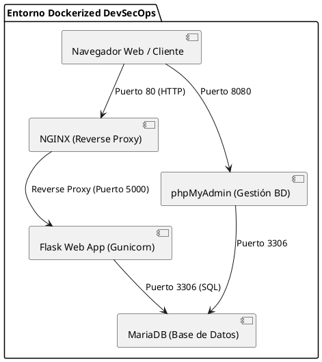
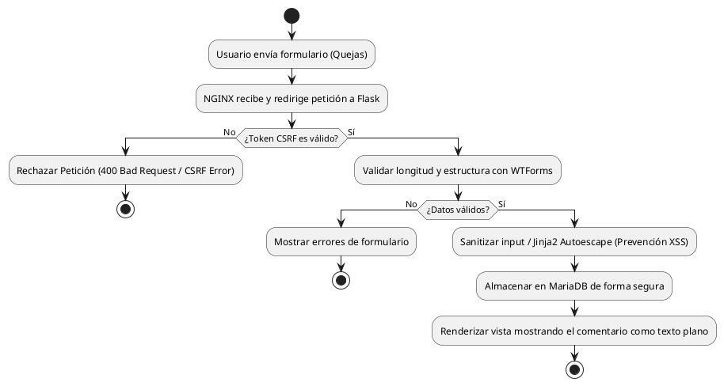

# Laboratorio N° 14: Prevención de Ataques XSS y CSRF en Aplicaciones Flask

Guía práctica y resumida de implementación DevSecOps para la prevención de **Cross-Site Scripting (XSS)** y **Cross-Site Request Forgery (CSRF)** en un entorno contenedorizado con Flask, NGINX, MariaDB y phpMyAdmin.

---

## 1. Diagramas de Arquitectura y Flujo (PlantUML)

### Diagrama de Bloques (Arquitectura del Sistema)


### Diagrama de Flujo (Validación de Petición Segura)


---

## 2. Estructura de Carpetas

```text
flask-xss-csrf-lab/
├── .env
├── .env.example
├── docker-compose.yml
├── nginx/
│   └── default.conf
└── app/
    ├── Dockerfile
    ├── requirements.txt
    ├── app.py
    ├── config.py
    ├── forms.py
    └── templates/
        └── queja.html
```

---

## 3. Flujo del Análisis de Código Estático (SAST)

El análisis estático de código evalúa el repositorio sin ejecutar la aplicación para identificar vulnerabilidades antes del despliegue:

1. **Trigger de CI/CD:** Ocurre un `git push` o `pull_request` en la rama principal.
2. **Escaneo Estático:**
   - **Semgrep:** Revisa que no se esté utilizando el filtro `| safe` de Jinja2 en plantillas que renderizan inputs de usuarios.
   - **Bandit:** Analiza código Python en busca de malas prácticas, hardcoded secrets y configuraciones inseguras.
3. **Control de Calidad (Quality Gate):** Si se detecta un riesgo alto (ej. Jinja2 con `| safe` inseguro o formularios sin CSRF), el pipeline falla y bloquea el despliegue.

---

## 4. `docker-compose.yml`

```yaml
version: '3.8'

services:
  web:
    build: ./app
    container_name: flask_sec_app
    restart: always
    environment:
      - SECRET_KEY=${SECRET_KEY}
      - DATABASE_URL=mysql+pymysql://${MYSQL_USER}:${MYSQL_PASSWORD}@db/${MYSQL_DATABASE}
    expose:
      - "5000"
    depends_on:
      - db

  nginx:
    image: nginx:alpine
    container_name: nginx_sec_proxy
    restart: always
    ports:
      - "80:80"
    volumes:
      - ./nginx/default.conf:/etc/nginx/conf.d/default.conf
    depends_on:
      - web

  db:
    image: mariadb:10.6
    container_name: mariadb_sec_db
    restart: always
    environment:
      MYSQL_ROOT_PASSWORD: ${MYSQL_ROOT_PASSWORD}
      MYSQL_DATABASE: ${MYSQL_DATABASE}
      MYSQL_USER: ${MYSQL_USER}
      MYSQL_PASSWORD: ${MYSQL_PASSWORD}
    volumes:
      - db_data:/var/lib/mysql

  phpmyadmin:
    image: phpmyadmin/phpmyadmin
    container_name: phpmyadmin_sec
    restart: always
    ports:
      - "8080:80"
    environment:
      PMA_HOST: db
      MYSQL_ROOT_PASSWORD: ${MYSQL_ROOT_PASSWORD}
    depends_on:
      - db

volumes:
  db_data:
```

---

## 5. Comandos de Verificación y Control

```bash
# 1. Construir y desplegar contenedores en segundo plano
docker-compose up -d --build

# 2. Verificar el estado de ejecucion de los servicios
docker-compose ps

# 3. Consultar logs del contenedor Flask
docker-compose logs -f web

# 4. Probar conectividad con el servicio NGINX
curl -I http://localhost
```

---

## 6. Configuración del Archivo `.env`

```ini
# Configuración Flask
FLASK_APP=app.py
FLASK_ENV=development
SECRET_KEY=clave_super_secreta_tecsup_devsecops_2026

# Configuración MariaDB / MySQL
MYSQL_ROOT_PASSWORD=root_secure_password_123
MYSQL_DATABASE=lab_sec_db
MYSQL_USER=flask_user
MYSQL_PASSWORD=user_secure_password_123
```

---

## 7. Archivo `app/requirements.txt`

```text
Flask==3.0.2
Flask-WTF==1.2.1
WTForms==3.1.2
Flask-SQLAlchemy==3.1.1
PyMySQL==1.1.0
gunicorn==21.2.0
python-dotenv==1.0.1
bleach==6.1.0
```

---

## 8. Código Backend (Protección CSRF y Sanitización XSS)

### `app/config.py`
```python
import os

class Config:
    SECRET_KEY = os.getenv('SECRET_KEY', 'default-key-dev')
    SQLALCHEMY_DATABASE_URI = os.getenv('DATABASE_URL', 'sqlite:///app.db')
    SQLALCHEMY_TRACK_MODIFICATIONS = False
```

### `app/forms.py`
```python
from flask_wtf import FlaskForm
from wtforms import StringField, TextAreaField, SubmitField
from wtforms.validators import DataRequired, Length

class QuejaForm(FlaskForm):
    nombre = StringField('Nombre', validators=[
        DataRequired(message="El nombre es obligatorio."),
        Length(max=50, message="Máximo 50 caracteres.")
    ])
    comentario = TextAreaField('Queja / Comentario', validators=[
        DataRequired(message="El comentario es obligatorio."),
        Length(max=200, message="Máximo 200 caracteres.")
    ])
    submit = SubmitField('Enviar Queja')
```

### `app/app.py`
```python
from flask import Flask, render_template, redirect, url_for, flash
from flask_wtf.csrf import CSRFProtect
from config import Config
from forms import QuejaForm

app = Flask(__name__)
app.config.from_object(Config)

# Proteccion CSRF Global activada
csrf = CSRFProtect(app)

# Base de datos simulada en memoria para el laboratorio
comentarios_db = []

@app.route('/queja', methods=['GET', 'POST'])
def queja():
    form = QuejaForm()
    if form.validate_on_submit():
        # Captura de datos
        nombre = form.nombre.data
        comentario = form.comentario.data
        
        # Almacenamiento seguro
        comentarios_db.append({'nombre': nombre, 'comentario': comentario})
        
        flash('Su queja ha sido registrada de forma segura.', 'success')
        return redirect(url_for('queja'))
        
    return render_template('queja.html', form=form, comentarios=comentarios_db)

if __name__ == '__main__':
    app.run(host='0.0.0.0', port=5000)
```

---

## 9. Frontend: Formulario con Bootstrap 5 (`app/templates/queja.html`)

```html
<!DOCTYPE html>
<html lang="es">
<head>
    <meta charset="UTF-8">
    <meta name="viewport" content="width=device-width, initial-scale=1.0">
    <title>Laboratorio N° 14 - Formulario Seguro</title>
    <link href="https://cdn.jsdelivr.net/npm/bootstrap@5.3.0/dist/css/bootstrap.min.css" rel="stylesheet">
</head>
<body class="bg-light">
<div class="container py-5">
    <div class="row justify-content-center">
        <div class="col-md-8">
            <div class="card shadow-sm mb-4">
                <div class="card-header bg-primary text-white">
                    <h4 class="mb-0">Libro de Quejas y Reclamos</h4>
                </div>
                <div class="card-body">
                    
                        
                            
                                <div class="alert alert-{{ category }} alert-dismissible fade show" role="alert">
                                    {{ message }}
                                    <button type="button" class="btn-close" data-bs-dismiss="alert"></button>
                                </div>
                            
                        
                    

                    <form method="POST" action="{{ url_for('queja') }}">
                        <!-- Proteccion CSRF automatica con Flask-WTF -->
                        {{ form.hidden_tag() }}

                        <div class="mb-3">
                            {{ form.nombre.label(class="form-label") }}
                            {{ form.nombre(class="form-control") }}
                            
                                <div class="text-danger small">{{ error }}</div>
                            
                        </div>

                        <div class="mb-3">
                            {{ form.comentario.label(class="form-label") }}
                            {{ form.comentario(class="form-control", rows="3") }}
                            
                                <div class="text-danger small">{{ error }}</div>
                            
                        </div>

                        {{ form.submit(class="btn btn-primary w-100") }}
                    </form>
                </div>
            </div>

            <!-- Lista de comentarios almacenados -->
            <div class="card shadow-sm">
                <div class="card-header bg-secondary text-white">
                    <h5 class="mb-0">Comentarios Registrados (Prevención XSS)</h5>
                </div>
                <ul class="list-group list-group-flush">
                    
                        <li class="list-group-item">
                            <!-- Jinja2 escapa automaticamente el HTML para prevenir XSS Stored -->
                            <strong>{{ item.nombre }}:</strong> {{ item.comentario }}
                        </li>
                    
                        <li class="list-group-item text-muted">No hay comentarios registrados.</li>
                    
                </ul>
            </div>
        </div>
    </div>
</div>
<script src="https://cdn.jsdelivr.net/npm/bootstrap@5.3.0/dist/js/bootstrap.bundle.min.js"></script>
</body>
</html>
```

---

## 10. Checkpoints de Verificación

### Checkpoint A: Protección CSRF
1. Abre en el navegador `http://localhost/queja`.
2. Haz clic derecho y selecciona **Ver código fuente de la página**.
3. Confirma la existencia del campo oculto inyectado por `Flask-WTF`:
   ```html
   <input id="csrf_token" name="csrf_token" type="hidden" value="IjE2YW...">
   ```

### Checkpoint B: Inyección XSS (Actividad 2 y 6)
1. En el campo *Comentario*, ingresa exactamente el siguiente payload:
   ```html
   <script>alert("Prueba XSS")</script>
   ```
2. Presiona **Enviar Queja**.
3. **Resultado Esperado:** 
   - No aparece ninguna ventana emergente `alert`.
   - En la lista de comentarios renderizada, el payload se muestra visiblemente como texto plano:
     `<script>alert("Prueba XSS")</script>`.

---

## 11. Evaluación de Código con Herramientas SAST Open Source

Para sustituir herramientas propietarias de alto costo en entornos DevSecOps, se utilizan **Bandit** y **Semgrep**:

### 1. Bandit (Escáner de Seguridad para Python)
Detecta llamadas a librerías Inseguras, hardcoded keys y funciones peligrosas.
```bash
# Instalación
pip install bandit

# Ejecución del análisis estático
bandit -r ./app
```

### 2. Semgrep (Escáner Multilenguaje)
Analiza patrones de código vulnerable, como la deshabilitación accidental del autoescape en Jinja2.
```bash
# Instalación
pip install semgrep

# Ejecución con reglas de seguridad web
semgrep --config p/owasp-top-ten ./app
```
